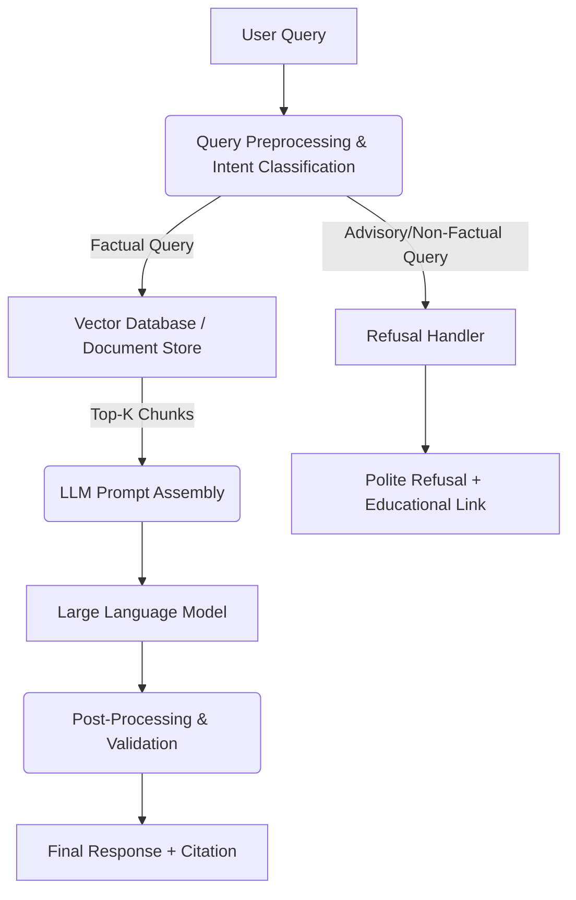

# Architecture Overview: Mutual Fund FAQ Assistant

## Introduction
The Mutual Fund FAQ Assistant uses a lightweight Retrieval-Augmented Generation (RAG) architecture to provide accurate, factual, and source-backed answers to user queries regarding Tata Mutual Fund schemes. The system is designed to prioritize accuracy and compliance over conversational capability.

## High-Level Architecture Diagram

## System Components

### 1. Data Ingestion & Processing Pipeline (Offline)
This offline component handles the corpus creation and indexing.
*   **Data Sources:** Official Tata Mutual Fund URLs, Factsheets, SIDs, and KIMs (e.g., Tata Gold ETF FoF, Tata Small Cap Fund).
*   **Document Loader:** Scrapes and parses text from public HTML pages and PDFs.
*   **Chunking Strategy:** Splits documents into small, context-aware chunks (e.g., chunking by section or paragraph to preserve tabular facts like expense ratios and fund management data).
*   **Embedding Model:** Converts text chunks into dense vector embeddings.
*   **Vector Database:** Stores the embeddings along with critical metadata (Source URL, Last Updated Date, Scheme Name).

### 2. Query Processing & Intent Classification (Online)
*   **Input Handling:** Receives the user's query from the minimal UI.
*   **Guardrails / Intent Classifier:** A crucial component that intercepts queries before retrieval. It categorizes the query as either:
    *   *Factual (Valid):* e.g., "What is the exit load?" -> Proceeds to Retrieval.
    *   *Advisory/Opinion (Invalid):* e.g., "Should I invest?" -> Triggers the Refusal Handler.

### 3. Retrieval Engine
*   **Semantic Search:** Uses the same embedding model to convert the user query into a vector and retrieves the Top-K most relevant chunks from the Vector Database.
*   **Metadata Filtering:** Can filter context based on the specific scheme mentioned in the query.

### 4. Generation Module (LLM)
*   **Prompt Engineering:** Constructs a strict prompt combining the user query and the retrieved context. The prompt forces the LLM to:
    *   Rely *only* on the provided context.
    *   Limit the response to a maximum of 3 sentences.
    *   Output factual data without any advisory language or opinions.
*   **Large Language Model (LLM):** Generates the concise answer based strictly on the prompt constraints.

### 5. Response Formatting & Validation (Post-Processing)
*   **Citation Injection:** Extracts the source URL and date from the retrieved chunk's metadata and appends the mandatory footer: `“Last updated from sources: <date>”` with the citation link.
*   **Compliance Check:** A final lightweight check to ensure no performance comparisons or advice slipped through.

## Refusal Handler
When an advisory or non-factual query is detected, this module bypasses the LLM generation and directly returns a template response that is polite, reinforces the "facts-only" limitation, and provides a relevant educational link (e.g., AMFI or SEBI resource).

## Key Design Constraints & Security
*   **No PII Storage:** The system architecture intentionally lacks a persistent user session database for PII (PAN, Account numbers, OTPs, etc.).
*   **Stateless Interaction:** Each query is treated independently to minimize context hallucination and privacy risks.
*   **Closed Domain:** The RAG system operates exclusively on the pre-defined corpus of official AMC/AMFI/SEBI URLs. External knowledge generation is disabled via prompt constraints.
